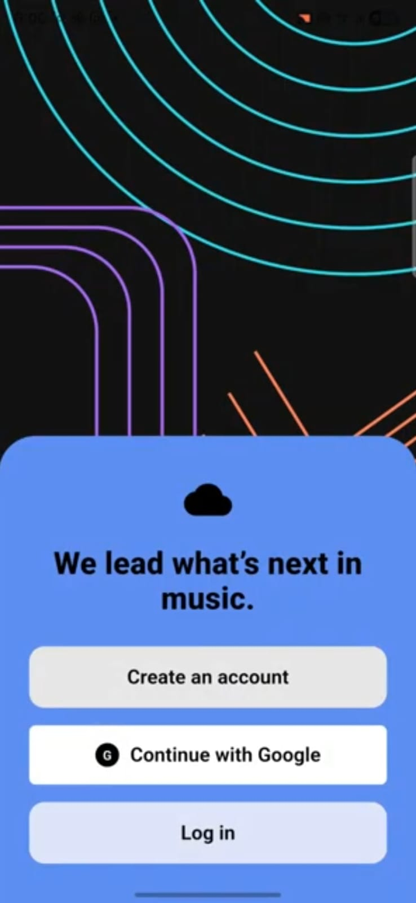
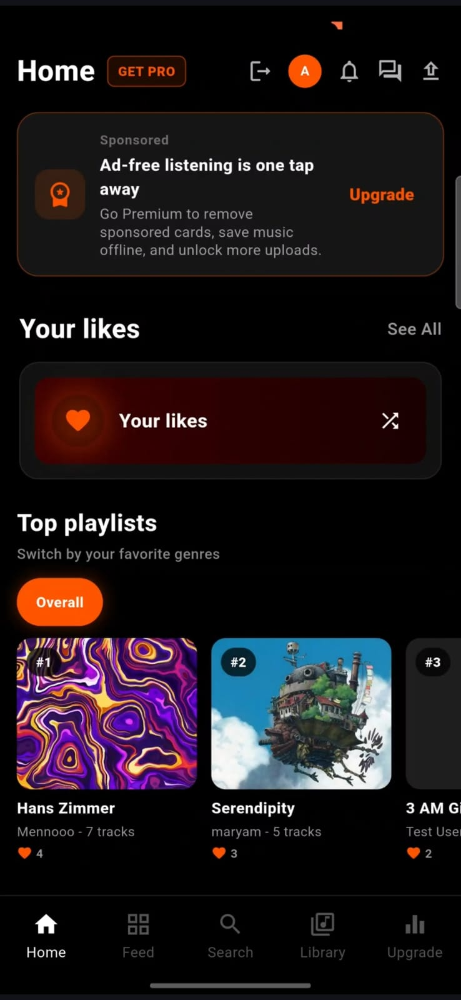
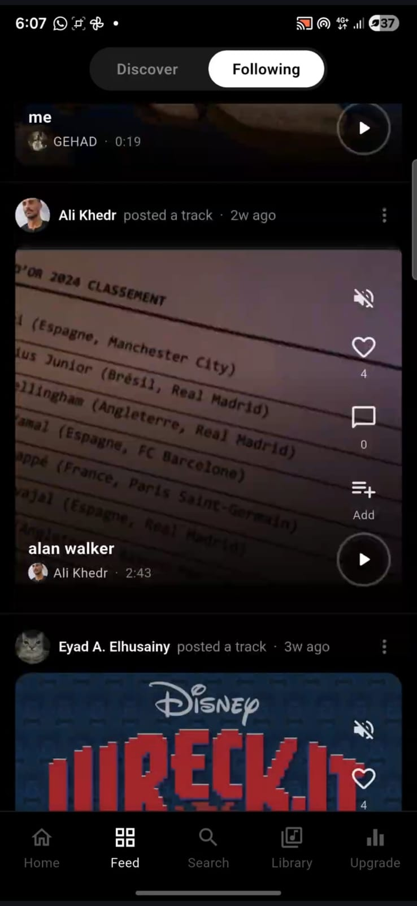
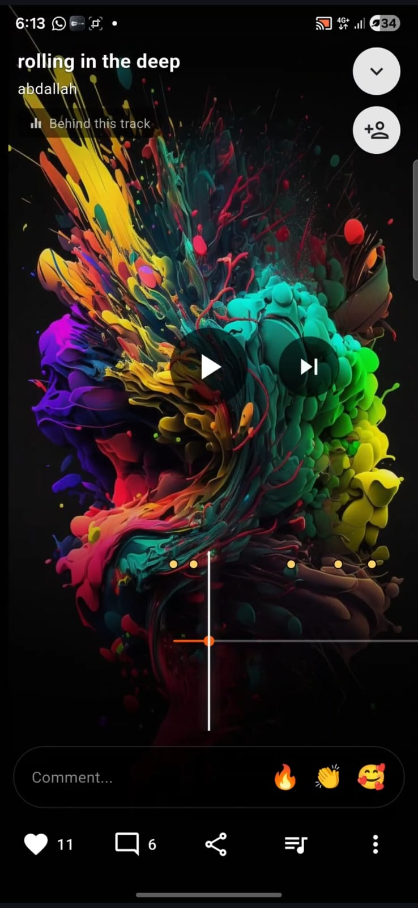
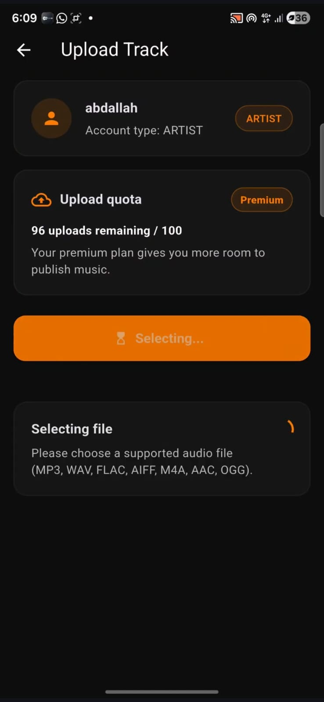
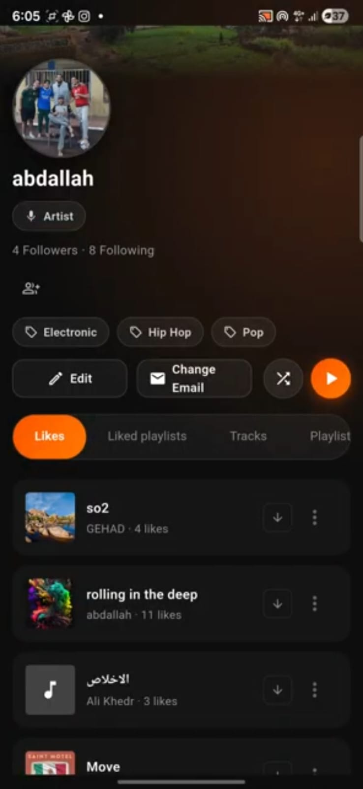
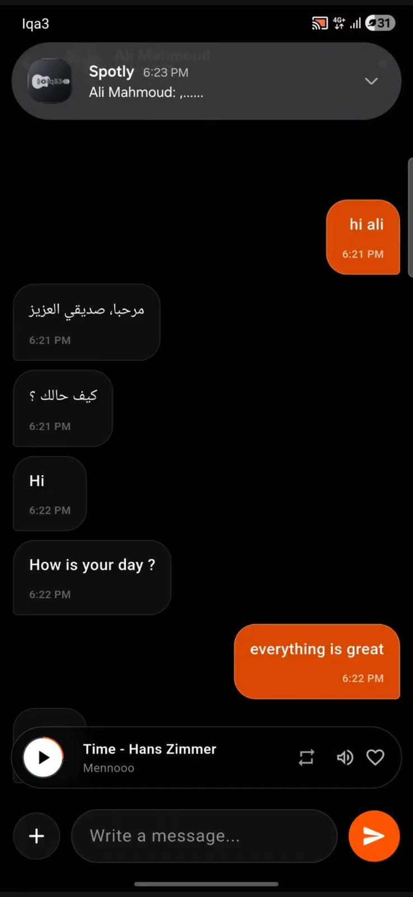
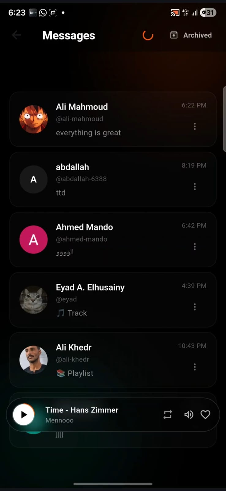

# Iqa3 — Cross-Platform SoundCloud Clone

A cross-platform **SoundCloud-style audio streaming client** built with **Flutter and Dart**.

Iqa3 provides a modern music platform experience across mobile and desktop targets, including authentication, profiles, feed/discovery, search, audio playback, upload workflows, track management, playlists, messaging, notifications, premium flows, and deep-link support.

---

## Overview

Iqa3 is a team-based Software Engineering course project that simulates a real-world audio streaming platform.

The project focuses on building a scalable cross-platform client using Flutter, clean modular architecture, state management, API integration, audio playback services, notifications, and sprint-based development practices.

The app was developed using an agile workflow with multiple sprints, manual QA plans, role-based tasks, and integration between frontend, backend, DevOps, and testing teams.

---

## My Role

I worked as a **cross-platform mobile/desktop developer** as part of the software engineering team.

My responsibilities included:

- Developing Flutter features for the cross-platform client
- Working with BLoC/Cubit-based state management
- Integrating UI screens with API-driven workflows
- Supporting feature integration across multiple app modules
- Participating in sprint-based development and testing
- Collaborating with frontend, backend, DevOps, and testing sub-teams
- Contributing to app stability, navigation, and user-facing flows

---

## Key Features

- Cross-platform Flutter client
- Authentication and user session handling
- Profile and social features
- Feed and discovery pages
- Search and genre navigation
- Audio playback system
- Mini-player and full-player experience
- Track upload workflow
- Track management for creators
- Public/private track visibility
- Shareable track links
- Playlist support
- Messaging and inbox workflows
- Notifications and FCM integration
- Premium and billing-related flows
- Deep-link handling for tracks, playlists, profiles, search, and billing returns
- Offline-related state support
- Sprint-based manual QA documentation

---

## App Modules

| Module | Description |
|---|---|
| Authentication | Login, register, password reset, session handling |
| Profile | User profiles, edit profile, avatar/cover flows |
| Social | Followers, following, suggested users, follow/unfollow behavior |
| Feed | User-facing content feed |
| Discovery | Content discovery and resource resolution |
| Search | Search pages and genre navigation |
| Playback | Full player, mini-player, audio handler, playback state |
| Upload | Audio file selection, metadata entry, visibility, upload lifecycle |
| Track Management | Edit metadata, change visibility, delete tracks |
| Library | Downloaded or saved items |
| Playlists | Playlist listing, playlist details, public/private playlist links |
| Messaging | Inbox and chat thread workflows |
| Notifications | FCM, preferences, notification tap routing |
| Premium | Upgrade and billing-related pages |
| Deep Links | Track, playlist, profile, search, sharing, and billing return routing |

---

## Architecture Highlights

The application uses a modular Flutter structure with separation between core services, app routing, features, presentation logic, and domain-related flows.

Key architectural elements include:

- Feature-based organization
- BLoC/Cubit state management
- Dependency injection with `get_it` and `injectable`
- API integration using `dio`
- Navigation with `go_router`
- Audio playback service using `just_audio` and `audio_service`
- Firebase Cloud Messaging integration
- Deep-link service integration
- Local storage support
- Testing documentation and sprint-based QA workflows

---

## Tech Stack

| Category | Technologies |
|---|---|
| Framework | Flutter |
| Language | Dart |
| State Management | flutter_bloc, Cubit/BLoC |
| Navigation | go_router, app_links |
| Networking | dio, cookie_jar, dio_cookie_manager |
| Dependency Injection | get_it, injectable |
| Audio Playback | just_audio, audio_service, audio_session |
| Notifications | Firebase Core, Firebase Messaging, Local Notifications |
| Storage | flutter_secure_storage, shared_preferences |
| File Handling | file_picker, image_picker, image_cropper |
| Realtime / Connectivity | socket_io_client, connectivity_plus |
| Serialization | freezed, json_serializable |
| Testing Tools | flutter_test, integration_test, mocktail, bloc_test |
| Platforms | Android, Windows Desktop, and Flutter-supported targets |

---

## System Workflow

```text
User Opens App
      ↓
App Initialization
      ↓
Firebase / FCM Setup
      ↓
Audio Service Initialization
      ↓
Dependency Injection Setup
      ↓
Deep Link Service Setup
      ↓
Authentication / Session Flow
      ↓
Feature Modules
      ↓
API + State Management
      ↓
Playback / Upload / Profile / Messaging / Notifications
```

---

## Development Workflow

The project followed a structured Software Engineering workflow, including:

- XP-inspired iterative development
- Sprint-based implementation
- 10-day sprint cycles
- Definition of Done
- Manual QA checklists
- Feature ownership
- Integration across sub-teams
- Frontend/backend coordination
- Testing and failure-path validation

---

## Manual QA Scope

The testing documentation covers important user flows, including:

- Android and Windows app launch
- Core tab navigation
- Registration and login
- Captcha behavior
- Forgot/reset password flows
- Profile opening and editing
- Followers/following states
- Upload permissions
- MP3/WAV file picking
- Upload metadata validation
- Upload lifecycle states
- Track management
- Public/private visibility
- Private sharing behavior
- Failure handling and retry paths

---

## Environment Configuration

This project uses compile-time environment variables through `--dart-define`.

The app does **not** load `.env` files directly.

Use `.env.example` as a reference for required variables.

### Required Variables

```text
APP_ENV
API_URL
USE_MOCK_TRACK_MANAGEMENT
MOCK_TRACK_MANAGEMENT_MODE
RECAPTCHA_ANDROID_SITE_KEY
RECAPTCHA_WINDOWS_WEB_URL
```

---

## Running the App

### 1. Clone the repository

```bash
git clone https://github.com/SWE-Team-9/Cross.git
cd Cross
```

### 2. Install dependencies

```bash
flutter pub get
```

### 3. Run on Android Emulator

```powershell
flutter run --dart-define=APP_ENV=dev --dart-define=API_URL=http://10.0.2.2:3006 --dart-define=USE_MOCK_TRACK_MANAGEMENT=false --dart-define=MOCK_TRACK_MANAGEMENT_MODE=success
```

### 4. Run on Windows Desktop

```powershell
flutter run -d windows --dart-define=APP_ENV=dev --dart-define=API_URL=http://localhost:3006 --dart-define=USE_MOCK_TRACK_MANAGEMENT=false --dart-define=MOCK_TRACK_MANAGEMENT_MODE=success
```

The repository also includes VS Code launch configurations for common development targets.

---

## Project Structure

```text
Cross/
  lib/
    app/
      app.dart
      router.dart
    core/
      audio/
      deep_links/
      di/
      widgets/
      notifiers/
    features/
      auth/
      profile/
      social/
      upload/
      playback/
      library/
      playlists/
      notifications/
      home/
      feed/
      discovery/
      search/
      messaging/
      premium/
      offline/
  docs/
    testing/
      app_keys.md
      sprint_0_1_2_3_manual_test_plan.md
  assets/
    app_icon/
    images/
  pubspec.yaml
  README.md
```

---

## Screenshots

### Welcome and Authentication Entry



### Home and Music Discovery



### Feed Experience



### Full Audio Player



### Track Upload Workflow



### Artist Profile



### Messaging Inbox



### Chat Thread with Mini Player



---

## Course Context

This project was developed for a **Software Engineering** course as a team-based product simulation.

The objective was to build a production-style cross-platform client while applying software engineering practices such as agile planning, sprint execution, testing, feature integration, and maintainable architecture.

---

## Learning Outcomes

This project strengthened my experience in:

- Flutter cross-platform development
- State management with BLoC/Cubit
- API integration and networked app workflows
- Modular app architecture
- Audio playback implementation
- Deep-link handling
- Firebase notification integration
- Upload and track-management flows
- Sprint-based software development
- Team collaboration and integration
- Manual QA and acceptance testing

---

## Future Improvements

- Add more automated widget and integration tests
- Improve UI consistency across Android and desktop targets
- Improve offline-mode documentation
- Add screenshots and demo videos
- Add architecture diagrams
- Improve developer onboarding documentation
- Add CI pipeline documentation
- Add clearer backend API documentation
- Improve release/build instructions

---

## Contributors

This project was developed by **SWE Team 9** as a team-based Software Engineering course project.

---

## License

This repository is currently shared for academic and portfolio purposes.

If the project is extended for public reuse, a formal open-source license should be added.
